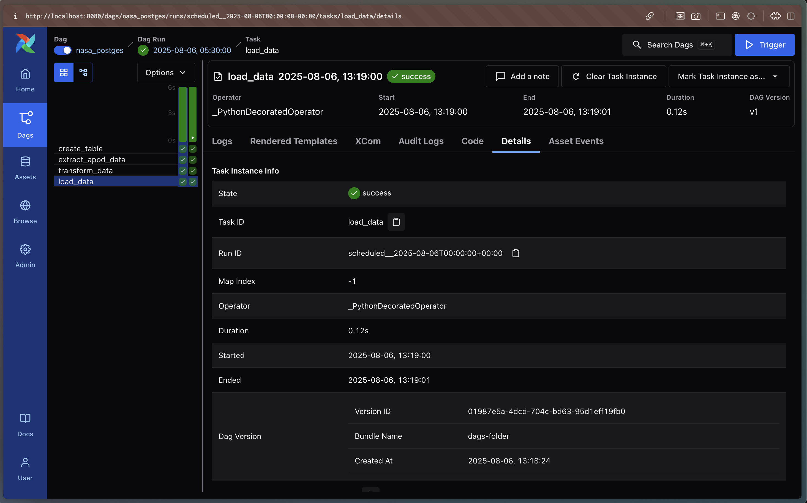
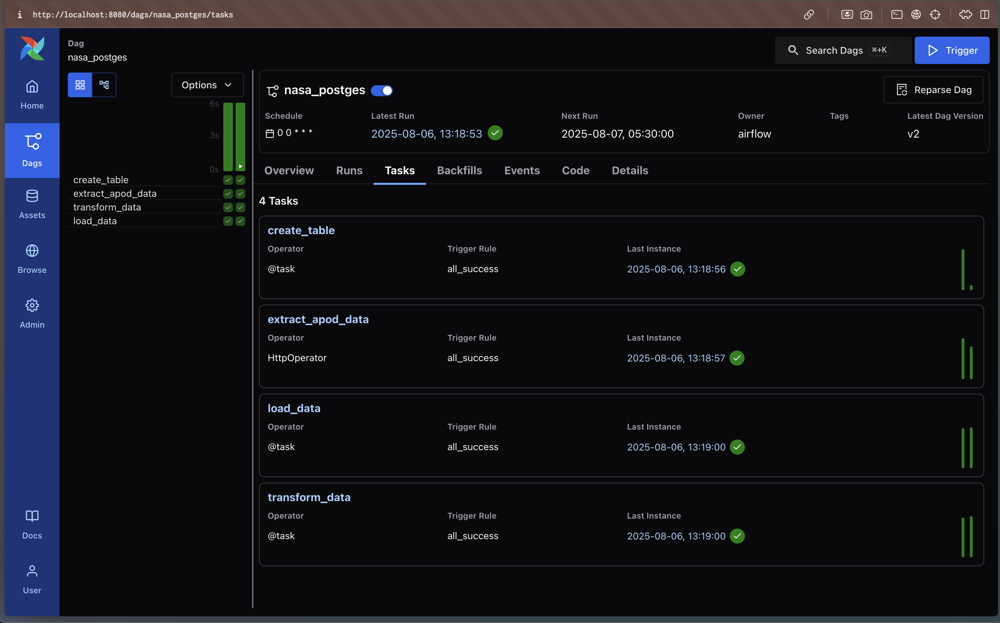

## ETL Pipeline with API Integration

This project implements an ETL (Extract, Transform, Load) pipeline that integrates with NASA's Astronomy Picture of the Day (APOD) API. The pipeline extracts data from the API, transforms it as needed, and loads it into a PostgreSQL database running in a Docker container.

**Pipeline Overview:**

1. **Extract:**  
   - Uses Airflow's HTTP operator to fetch data from the NASA APOD API.

2. **Transform:**  
   - Processes and transforms the API response using Python code.
   - Handles data in JSON format.

3. **Load:**  
   - Loads the transformed data into a PostgreSQL database.

**Key Features:**
- Orchestrated and monitored using Apache Airflow.
- API connections are managed via Airflow's connection settings.
- All services (Airflow, PostgreSQL) run in Docker containers for easy setup and deployment.

This setup allows for automated, repeatable data ingestion from the NASA APOD API into a robust database, with monitoring and scheduling handled by Airflow.

## Screenshots for implementation 

